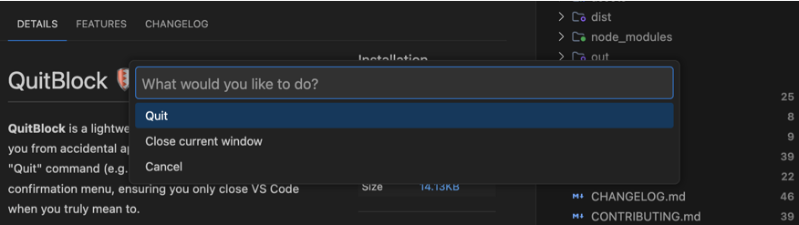

# QuitBlock 🛡️

**QuitBlock** is the ultimate safety net for VS Code. It intercepts native workspace-closing shortcuts (like `Cmd+Q` or `Cmd+W`) and presents a smart confirmation menu, ensuring you never accidentally exit your editor or lose the context of your unsaved work again.

## ⚠️ The Problem
We've all been there: you're in the zone, trying to close a tab with `Cmd+W`, but your finger slips and hits `Cmd+Q`. Suddenly, your entire workspace disappears, along with your momentum and unsaved context.

## ✅ The Solution: QuitBlock
QuitBlock acts as a safety net. Instead of an immediate exit, it triggers a clean, native VS Code menu asking for confirmation.

### ✨ Key Features
- **Accidental Exit Prevention**: Native intercept of the quit shortcut.
- **Smart Context Options**:
  - 🚪 **Quit**: Confirms and exits the entire application.
  - 🪟 **Close current window**: Closes only the active window, keeping others alive.
  - ❌ **Cancel**: Just a slip of the finger? Back to work instantly.
- **Seamless Integration**: Replaces default `Cmd+Q` (Mac) or `Ctrl+Shift+W` (Windows/Linux) behavior.
- **Remote Ready**: Zero-config support for SSH, WSL, and Dev Containers.

## 🚀 How to Use
1. Use your usual quit shortcut:
   - **macOS**: `Cmd+Q`
   - **Windows/Linux**: `Ctrl+Shift+W` (or custom bindings)
2. Use window close triggers: `Cmd+Shift+W` or `Cmd+W`.
3. Or run **"QuitBlock: Quit"** from the Command Palette (`Cmd+Shift+P`).

## 🛠️ Configuration
QuitBlock respects your workflow. You can customize which shortcuts trigger the block in VS Code's **Keyboard Shortcuts** by searching for `quitblock.quit`.

## 📦 Installation
1. Open **VS Code**.
2. Go to the **Extensions** view (`Cmd+Shift+X`).
3. Search for **QuitBlock**.
4. Click **Install**.

---

Developed with ❤️ by [brunobrise](https://github.com/brunobrise)

